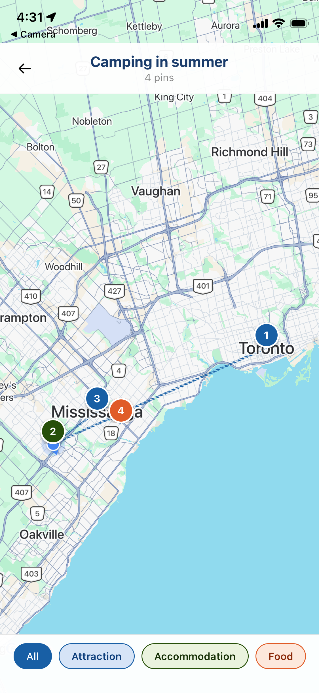

# Personal Trip Planner

A mobile app for planning, organizing, and remembering every personal trip — built with React Native, Expo, and Firebase.

## Features

#### Authentication
- User registration and login
- Persistent session across app restarts
- Auto-redirect based on auth state

#### Trip management
- Create and manage trips
- Add multiple destinations
- Set start/end dates and total budget
- View budget breakdown and cost estimates
- Delete trips with confirmation

#### Itinerary management
- View activities grouped by day
- Add, edit, and delete activities
- Category tags: Food, Transport, Attraction, Accommodation
- Mark activities as booked with confirmation details

#### Map and location
- Google Places autocomplete when adding an activity location
- View all activity pins on an interactive Google Map
- Filter pins by category
- Route polyline connecting pins in chronological order
- Tap a pin to see activity details

#### Security
- Firestore rules lock all data to the authenticated owner
- Users, trips, and activities each enforce ownership checks

## Screenshots

| Welcome | Login | Sign up |
|---------|-------|---------|
|  |  |  |
| Entry point with Get started and Sign in | Email + password with show/hide toggle | Name, email, password, confirm password |

| Home | Create trip | Trip summary |
|------|-------------|-------------|
|  |  |  |
| All trips listed with status badges | Name, destinations, date range, budget | Budget bar and cost estimates breakdown |


| Activities | Add activity | Edit activity |
|---------|-------|---------|
|  |  |  |
| Day-grouped list with category color dots | Title, location, category, date, time, duration | Update fields, mark as booked, and delete |

| Trip Map |
|---------|
|  |
| Pins/filter by category, route polyline |

## Tech stack

| Layer | Technology | Purpose |
|-------|-----------|---------|
| Framework | React Native + Expo SDK 54 | Cross-platform iOS and Android |
| Language | TypeScript | Type-safe development |
| Routing | Expo Router v6 | File-based screen navigation |
| Auth | Firebase Authentication | Email/password login and session |
| Database | Cloud Firestore | Real-time trip data storage |
| Maps | react-native-maps + Google Maps SDK | Interactive map with custom markers |
| Location search | Google Places API | Activity location autocomplete and coordinates |
| Safe areas | react-native-safe-area-context | Notch and home bar handling |


## Getting started

### Prerequisites

- Node.js 18+
- Expo Go app on your phone 

### 1. Clone and install

```bash
git clone https://github.com/xhu72/personal-trip-planner.git
cd personal-trip-planner
npm install
```

### 2. Set up environment variables

```env
EXPO_PUBLIC_FIREBASE_API_KEY=
EXPO_PUBLIC_FIREBASE_AUTH_DOMAIN=
EXPO_PUBLIC_FIREBASE_PROJECT_ID=
EXPO_PUBLIC_FIREBASE_STORAGE_BUCKET=
EXPO_PUBLIC_FIREBASE_MESSAGING_SENDER_ID=
EXPO_PUBLIC_FIREBASE_APP_ID=
EXPO_PUBLIC_GOOGLE_MAPS_API_KEY=
```

### 3. Firebase setup

1. Create a project at [console.firebase.google.com](https://console.firebase.google.com)
2. Enable **Authentication → Email/Password**
3. Create a **Firestore** database in test mode
4. Deploy security rules: paste the contents of `firestore.rules` into **Firestore → Rules** and click Publish

### 4. Run

```bash
npx expo start --clear
```

Scan the QR code with Expo Go on your phone.


