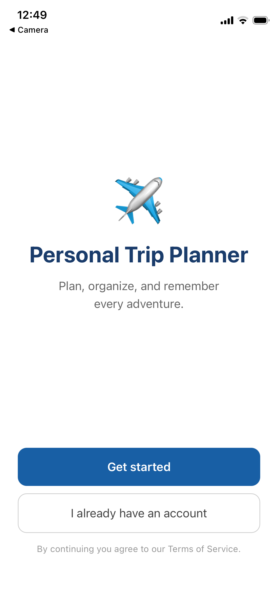
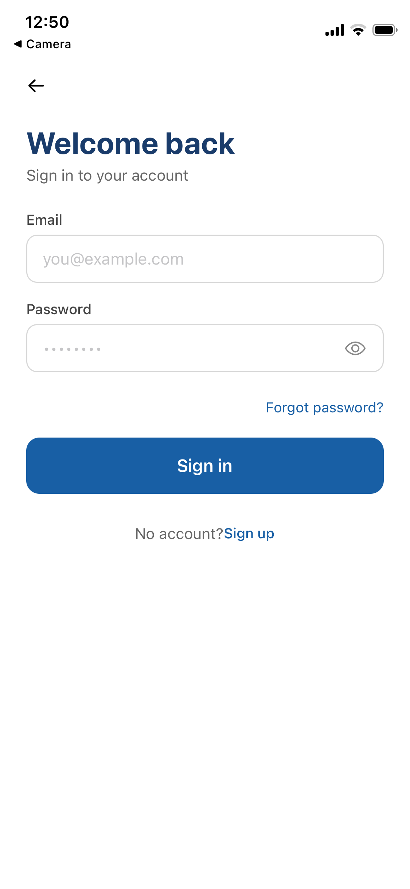
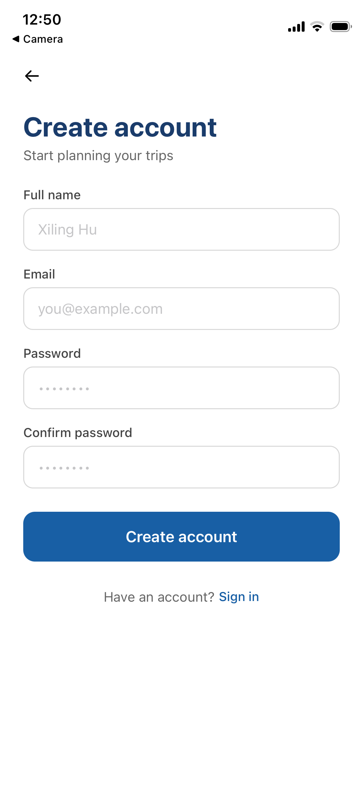
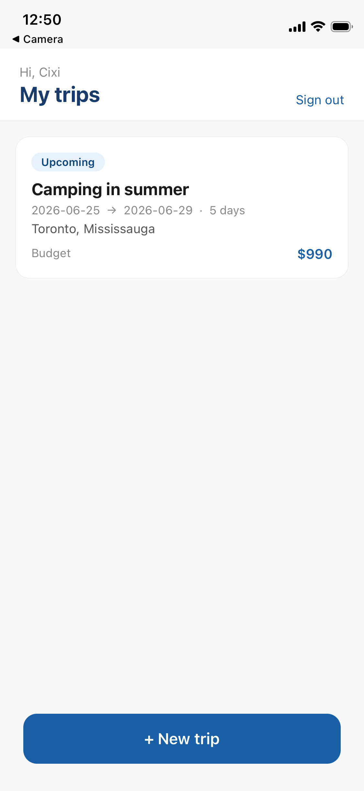
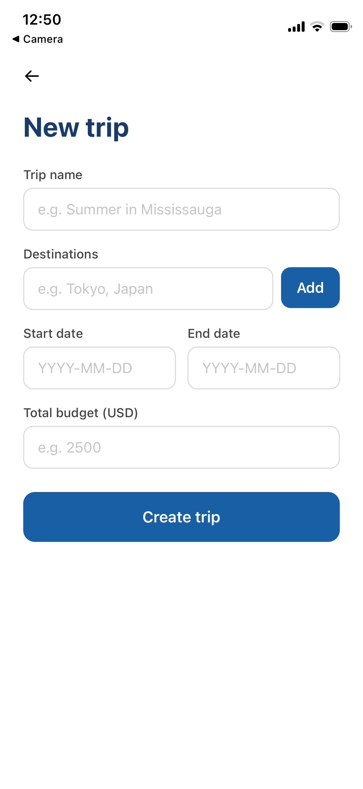
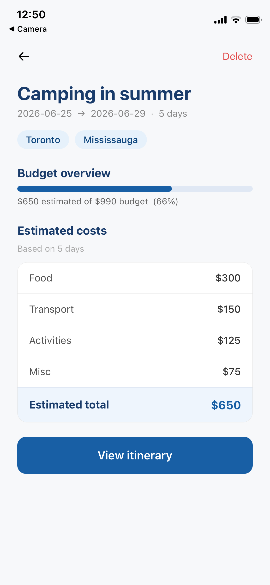

# Personal Trip Planner

A mobile app for planning, organizing, and remembering every personal trip — built with React Native, Expo, and Firebase.

## Features
### Authentication
- **Welcome screen**: clean entry point with Get started and Sign in flows
- **Sign up screen**: create an account with name, email, and password; profile saved to Firestore
- **Login screen**: sign in with email and password; show/hide password toggle
- **Persistent session**: Firebase Auth remembers you across app restarts
- **Auto-redirect**: RouteGuard sends logged-in users straight to Home, logged-out users to Welcome
- **Sign out**: clears session and redirects immediately

### Trip management
- **Home screen**: lists all your trips with status badges (Upcoming / Active / Completed), and empty state
- **Create trip screen**: trip name, multi-destination adding, start/end dates with live day count, and total budget
- **Trip summary screen**: destination info, budget progress bar, per-day cost estimates broken down by category, over-budget warning
- **Delete trip**: confirmation alert before permanent deletion

### Security
- Firestore security rules lock every read and write to the authenticated owner

## Screenshots


| Welcome | Login | Sign up |
|---------|-------|---------|
|  |  |  |
| Entry point with Get started and Sign in | Email + password with show/hide toggle | Name, email, password, confirm password |

| Home | Create trip | Trip summary |
|---------|-------|---------|
|  |  |  |
| Trip cards with status badges | multi-destinations, dates, budget | Budget bar, cost breakdown, over-budget warning |

---

## Tech stack

| Layer | Technology | Purpose |
|-------|-----------|---------|
| Framework | React Native + Expo SDK 54 | Cross-platform iOS and Android |
| Language | TypeScript | Type-safe development |
| Routing | Expo Router v6 | File-based screen navigation |
| Auth | Firebase Authentication | Email/password login and session |
| Database | Cloud Firestore | Real-time trip data storage |
| Location search | Google Places API | Destination autocomplete |
| Safe areas | react-native-safe-area-context | Notch and home bar handling |


## Getting started

### Prerequisites

- Node.js 18+
- Expo Go app on your phone 

### 1. Clone and install

```bash
git clone https://github.com/xhu72/personal-trip-planner.git
cd personal-trip-planner
npm install
```

### 2. Set up environment variables

```env
EXPO_PUBLIC_FIREBASE_API_KEY=
EXPO_PUBLIC_FIREBASE_AUTH_DOMAIN=
EXPO_PUBLIC_FIREBASE_PROJECT_ID=
EXPO_PUBLIC_FIREBASE_STORAGE_BUCKET=
EXPO_PUBLIC_FIREBASE_MESSAGING_SENDER_ID=
EXPO_PUBLIC_FIREBASE_APP_ID=
```

### 3. Firebase setup

1. Create a project at [console.firebase.google.com](https://console.firebase.google.com)
2. Enable **Authentication → Email/Password**
3. Create a **Firestore** database in test mode
4. Deploy security rules: paste the contents of `firestore.rules` into **Firestore → Rules** and click Publish

### 4. Run

```bash
npx expo start --clear
```

Scan the QR code with Expo Go on your phone.


